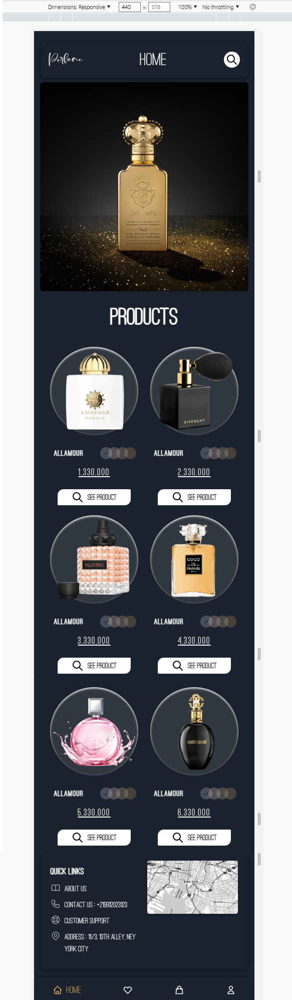

# Perfume Shop by Elle Famkar (developed with tailwind and alpine js)

## Welcome to my project guys! 👋
 important point : remember to install node package and then command -> npm run dev so as to start the project

## Table of contents

-  [Overview](#overview)
   -  [The challenge](#the-challenge)
   -  [Screenshot](#screenshot)
   -  [Links](#links)
-  [My process](#my-process)
   -  [Built with](#built-with)
   -  [What I learned](#what-i-learned)
   -  [Continued development](#continued-development)
   -  [Useful resources](#useful-resources)
-  [Author](#author)
-  [Acknowledgments](#acknowledgments)

## Overview

Thanks for checking out this front-end project. My main aim was to develop a project using tailwind, which i enjoyed so much and definitely will work more with tailwind instead of bootstrap or sass or pure css. Hope you enjoy it too.

Remember that "Every day is a learning day", so let's checkout the requirements to start such project

### The challenge

In his project you should be able to:

-  View the optimal layout for the component depending on their device's screen size
-  Use alpinejs as a new way to use js in your project
-  Use tailwind as your css framework

### Screenshot




### Links

-  Live Site URL: [mini perfume shop](https://ellefamkar.github.io/perfume-shop/)

## My process

### Where to find resources

We know what we need first, yes! you are right, the design file. So let's checkout this repository to find even the smallest details about the style requirements of this project such as `font-size`, `padding` and `margin` as well as finding all the required assets in the `/images` folder. The assets are already optimized. `color palette` is also available in figma file to guide you to choose the accurate colors.

### Built with

-  Semantic HTML5 markup
-  tailwind
-  alpine js
-  Mobile-first workflow

You can use any tools you like to help you complete the project. So if you got something you'd like to practice, feel free to give it a try.

### What I learned

This projects helped me being more familiar with the details of html, tailwind and alpine js together to create a responsive project with small details on colors,sizes and so on. It was a great experience to built such a project with such different css framework.

To see parts of my codes and see how you can add code snippets, see below:

```html
<div class="flex md:hidden rounded-md border my-2 border-gray-900 shadow-gray-900 shadow-md items-center justify-between p-4">
   <a href="#" class="font-serif text-4xl">Perfume</a>
   <span class="text-4xl">home</span>
   <div class="w-8 h-8 rounded-full bg-white flex items-center cursor-pointer justify-center">
      <svg xmlns="http://www.w3.org/2000/svg" class="h-6 w-6 hover:text-darkGold stroke-black" fill="none" viewBox="0 0 24 24" stroke-width="2">
         <path stroke-linecap="round" stroke-linejoin="round" d="M21 21l-6-6m2-5a7 7 0 11-14 0 7 7 0 0114 0z" />
      </svg>
   </div>
</div>
```

```css
<div class="flex md:hidden rounded-md border my-2 border-gray-900 shadow-gray-900 shadow-md items-center justify-between p-4">
       <a href="#" class="font-serif text-4xl">Perfume</a>
       <span class="text-4xl">home</span>
</div>

```

```js  - using alpine js
 <div x-data="{colorOne : 'slate'}" class="flex items-center">
       <button @click="colorOne = 'slate'" :class="colorOne === 'slate' ? 'bg-opacity-100' : ' '" class="w-6 h-6 flex items-center justify-center -m-1 bg-slate-300 bg-opacity-25 rounded-full cursor-pointer">
         <svg x-show="colorOne === 'slate'" xmlns="http://www.w3.org/2000/svg" class="h-4 w-4 fill-black opacity-40" viewBox="0 0 20 20" fill="currentColor">
           <path fill-rule="evenodd" d="M16.707 5.293a1 1 0 010 1.414l-8 8a1 1 0 01-1.414 0l-4-4a1 1 0 011.414-1.414L8 12.586l7.293-7.293a1 1 0 011.414 0z" clip-rule="evenodd" />
         </svg>
       </button>              
   </div>
```

### Continued development

In my future projects, not only i am going to focus on improving my basic knowledge of front end development (html and css), but also i will make it more dynamic and use javascript so as to develop cooler projects. I will also try to be much more familiar with UI design so as to better understand my clients needs and requirements.

### Useful resources

In order to do this project in a correct way you need to have a good knowledge of html and pure css and grid and then tailwind and you need to know how to work with alpine js in the project and connect it to css if you want to use js.
-  [w3schools](https://www.w3schools.com/)
-  [MDN](https://developer.mozilla.org/en-US/) - Remember that no matter how many tutorial videos you have watched, you always need to learn details and features from codes documentations
-  [codeacademy](https://www.codecademy.com/)
-  [udemy](https://www.udemy.com/) - Here you can find a number of tutorials in different languages
-  [coursera](https://www.coursera.org/)

To my persian friends:
You can benefit from this complete article on which sources to use to master flex and grid.

-  [Elle Famkar - Virgool](https://vrgl.ir/2alVC)

## Author

-  Website - My website is under construction but you can find my works here : [Elle Famkar](https://github.com/ellefamkar)
-  Twitter - [@Ellefamkar](https://www.twitter.com/ellefamkar)

Feel free to ask any questions come to your mind on my github account!

## Acknowledgments

I want to thanks my tailwind mentor, [Saheb Mohammadi](https://www.fronthooks.ir/), who has been inspiring and helpfull with great projects, tips and lessons.

**Have fun using this project!** 🚀
